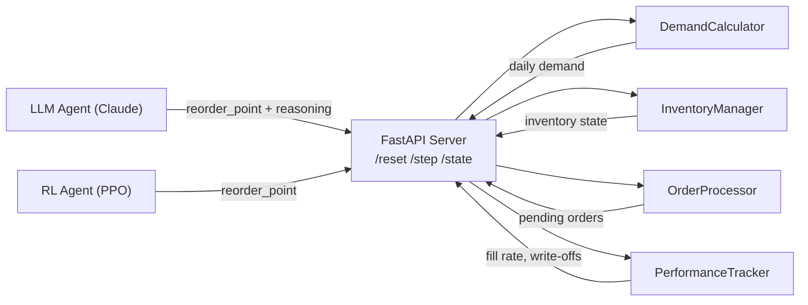

# Agents Comparison: LLM (Claude) vs. RL (PPO)

> **Inventory Optimization on the OpenEnv HTTP Server**

---

## 1. Overview

Both agents interact with the same stateless FastAPI server via three endpoints: `POST /reset`, `POST /step`, and `GET /state`. The server simulates a stochastic inventory system over a **730-day horizon** (365-day burn-in for history, 365-day evaluation window). At every step, an agent submits a single continuous action — `reorder_point: float` — and receives an `InventoryObservation` in return. The shared objective is to **maximize fill rate** (fraction of demand fulfilled) while **minimizing write-offs** (inventory lost to spoilage). Despite sharing the same interface and objective, the two agents differ fundamentally in how they learn, reason, and generalize.

---

## 2. The Environment

The simulation models a perishable-goods inventory system with four distinct demand regimes:

| `env_type` | Name | Description |
|---|---|---|
| `0` | `GammaPoisson` | 90/10 mixture of Gamma and Poisson; heavy tails from rare large orders |
| `1` | `GammaGammaHighVariance` | 50/50 mixture of a low-mean Gamma (μ≈21) and a high-mean Gamma (μ≈203); bimodal |
| `2` | `SpikingDemand` | Base Gamma with sporadic high-demand spikes; non-stationary bursts |
| `3` | `SingleGammaLowVariance` | Single Gamma (μ≈112); the most tractable regime |

All regimes apply seasonal multipliers by month and weekday, adding a slow-cycle structure on top of the stochastic base.

**Key mechanics:**

- **Lead time**: Orders placed on day `d` arrive on day `d + 3`. The agent must order before stockouts occur, not in response to them.
- **Write-offs**: Every 7 days, 1% of on-hand inventory is destroyed (`WRITE_OFF_RATE = 0.01`, `WRITE_OFF_FREQUENCY = 7`). Over-ordering is penalized even if demand is eventually fulfilled.
- **Reorder logic**: If `current_inventory ≤ reorder_point`, the server places a replenishment order for approximately `reorder_point - current_inventory + mean_demand_30d × lead_time` units.
- **Reward structure**: `-0.001` per step (365 steps × -0.001 = -0.365 total step penalty); the terminal reward at day 730 is the final fill rate (a value in [0, 1]). This is a **sparse reward** — the vast majority of signal arrives in a single scalar at the end of the episode.

The sparse reward makes standard RL approaches struggle: an agent that takes a poor reorder decision on day 400 may not observe the consequence until day 730. For an LLM agent reasoning from context, however, sparsity is less of a concern — it does not need to backpropagate gradients through 365 timesteps.

---

## 3. The LLM Agent (Claude)

The LLM agent treats each step as a language reasoning problem. At every timestep, it constructs a structured JSON prompt encoding the current observation — inventory level, 30-day demand statistics, pending orders, fill rate, recent stockouts — and sends it to the Claude API. Claude responds with a `reorder_point` and a natural-language `reasoning` field explaining the decision.

**Memory architecture:**

- **Rolling memory bank** (last 15 decisions): a structured log of recent `(day, inventory, demand_mean, reorder_point_chosen, fill_rate)` tuples prepended to the prompt. This gives the model long-horizon awareness without exceeding context limits.
- **Conversation history** (last 6 turns): the raw message history is retained to preserve stylistic and strategic continuity across consecutive decisions.

**Key properties:**

- **Zero-shot**: No training data, no fine-tuning. The agent's inventory intuition is inherited from pretraining on supply chain literature, textbooks, and code.
- **Interpretable**: Every decision comes with a reasoning trace. Auditors and operators can inspect *why* a reorder point was set to a specific value.
- **Adaptive**: When demand spikes or the regime shifts, the model can reason about anomalies explicitly and adjust its strategy in a single prompt, without waiting for a gradient update.

**Weaknesses:** One API call per step means 365 calls per episode — slow and expensive. The model is non-deterministic; two identical observations can yield different reorder points. There is no guarantee the model's stated reasoning reflects its actual computation, and hallucinated "inventory intuition" can be confidently wrong.

---

## 4. The RL Agent (PPO)

The RL agent maps a **22-float observation vector** (current inventory, demand statistics, fill rate, pending order counts, days remaining, etc.) directly to a `reorder_point` via a learned MLP policy network.

**Algorithm — Proximal Policy Optimization (PPO):**

PPO is an on-policy actor-critic algorithm. It collects rollouts under the current policy, estimates advantages using Generalized Advantage Estimation (GAE), and updates the policy with a clipped surrogate objective:

```
L_CLIP(θ) = E[ min(r_t(θ) · A_t,  clip(r_t(θ), 1-ε, 1+ε) · A_t) ]
```

The clip prevents destructively large policy updates, stabilizing training across thousands of episodes.

**The credit assignment problem:**

With a 365-step evaluation window and a terminal reward only at day 730, RL faces a fundamental credit assignment challenge. Consider an analogy: imagine a chess player who only learns "you won" or "you lost" after the entire game, with no intermediate feedback. Attributing that outcome to a specific move made 200 turns earlier requires the value function to propagate signal through hundreds of timesteps — a task that strains even modern RL methods.

**Reward shaping** addresses this by constructing a dense proxy reward at each step:

```python
shaped_reward = fill_rate_delta * 10 - lost_sales * 0.01 - holding_cost * 0.0001
```

This gives the agent immediate signal: increasing fill rate is rewarded, lost sales are penalized, and excess inventory is lightly penalized. The trade-off is **reward hacking**: an agent optimizing the shaped reward may find strategies that score well on the proxy but diverge from the true objective (final fill rate). Shaped reward ≠ true objective, and the gap can be significant in novel demand regimes.

**Key properties:**

- **Fast inference**: A single forward pass through the MLP takes microseconds, enabling thousands of episodes without API cost.
- **Deterministic** (at inference): Given the same observation, the policy always produces the same action.
- **Improves with data**: More training episodes → better value estimates → better policy.

**Weaknesses:** Requires thousands of training episodes before the policy is competitive. The learned weights are opaque — there is no way to ask *why* a specific reorder point was chosen. Reward shaping introduces hyperparameters that are brittle across demand regimes.

---

## 5. Side-by-Side Comparison

| Dimension | LLM Agent (Claude) | RL Agent (PPO) |
|---|---|---|
| **Training required** | None (zero-shot) | Yes — 1000s of episodes |
| **Inference speed** | Slow (~1–3 s/step via API) | Fast (~<1 ms/step, MLP forward pass) |
| **Interpretability** | High — natural language reasoning per step | Low — black-box MLP weights |
| **Sample efficiency** | Extremely high — 1 episode sufficient | Low — needs many episodes to converge |
| **Adapts to new demand regimes** | Yes — prompt-level reasoning | Requires retraining or fine-tuning |
| **Handles sparse rewards natively** | Yes — no gradient propagation needed | No — requires reward shaping |
| **Cost per episode** | High (~365 API calls × token cost) | Near zero at inference |
| **Human-readable decisions** | Yes — reasoning field in every action | No |

---

## 6. Architecture Diagram



---

## 7. The Credit Assignment Problem

Sparse rewards are fundamentally hostile to gradient-based learning. In this environment, 365 steps elapse between the first action and the terminal reward. The RL value function must learn that a reorder decision made on day 400 — which prevented a stockout on day 403 — contributed to the fill rate observed on day 730. To propagate this signal, the agent must learn an accurate model of the environment's dynamics purely from scalar rewards.

**Analogy**: Imagine grading a student's entire semester based solely on their final exam score, with no feedback on homework, quizzes, or midterms. The student has to infer which study habits caused their outcome from a single number received months later.

Reward shaping injects intermediate feedback by computing a proxy signal at each step. In this project:

```python
shaped_reward = fill_rate_delta * 10 - lost_sales * 0.01 - holding_cost * 0.0001
```

The `fill_rate_delta` term rewards each incremental improvement in fulfilled demand. The `lost_sales` penalty immediately punishes stockouts rather than waiting for the terminal signal. The `holding_cost` term discourages over-ordering.

The critical limitation is that this proxy is a **surrogate** for the true objective. An RL agent trained on the shaped reward may learn to maximize `fill_rate_delta` aggressively early in the episode — inflating inventory — while the resulting write-offs degrade the true terminal fill rate. The shaped reward tells the agent *what to pursue step-by-step*, but that prescription may conflict with the actual goal. Designing a shaped reward that is simultaneously dense, informative, and perfectly aligned with the terminal objective is an unsolved engineering challenge in practice.

---

## 8. When to Use Each

**Use the LLM agent when:**

- **Interpretability is required**: Operators need to audit or explain reorder decisions to stakeholders.
- **The environment is novel or rapidly changing**: A new demand regime, an unexpected seasonality shift, or a supply disruption that has never appeared in training data.
- **Few episodes are available**: One-shot or few-shot evaluation, A/B tests, or pilot deployments where collecting thousands of training episodes is impractical.
- **API cost is acceptable**: Budget exists for per-step inference, and latency is not a hard constraint.

**Use the RL agent when:**

- **Inference latency is critical**: Real-time systems where decisions must be made in milliseconds.
- **Many training episodes are available**: A stable simulation or historical replay buffer allows the policy to converge.
- **The demand regime is stable and well-characterized**: The policy generalizes within its training distribution but degrades outside it; a predictable environment limits this risk.
- **Cost per episode must be minimized**: Deploying against a live API at scale makes per-step LLM calls economically infeasible.

---

## 9. The Interesting Experiment

The central hackathon question: **can a zero-shot LLM agent outperform 1000 episodes of PPO training?**

This is not a rhetorical question. It probes a genuine empirical tension: LLMs trained on internet-scale corpora have absorbed an enormous amount of supply chain knowledge — textbooks, case studies, operations research papers. A capable LLM may already possess a strong *world model* of inventory dynamics, allowing it to reason near-optimally with zero environment interaction. A PPO agent, by contrast, must discover inventory dynamics from scratch through trial and error in the simulation.

**Metrics to compare:**

| Metric | Definition | Favors |
|---|---|---|
| **Final fill rate** | `total_fulfilled / total_demand` at day 730 | Higher is better |
| **Stockout rate** | `stockouts / evaluation_days` | Lower is better |
| **Total write-offs** | Cumulative inventory written off over 365 eval days | Lower is better |
| **Variance across episodes** | Std dev of fill rate over multiple runs | Lower is better (stability) |

**What "winning" looks like:**

- *LLM wins*: Higher mean fill rate with fewer stockouts in 5–10 evaluation episodes, despite zero training. This would suggest that language model world models are competitive with — or superior to — learned policies at moderate sample budgets, and that interpretable reasoning can substitute for data-driven optimization in long-horizon sparse-reward problems.
- *RL wins*: PPO achieves higher fill rate with lower variance after 1000 episodes, especially on the stable `SingleGammaLowVariance` regime. This would confirm that domain-specific optimization via environment interaction surpasses general-purpose reasoning when sufficient data is available.
- *The interesting middle ground*: LLM outperforms PPO on `SpikingDemand` (novel, non-stationary) but underperforms on `SingleGammaLowVariance` (stable, tractable). This would reveal a clean **regime boundary**: LLMs are more sample-efficient and robust on out-of-distribution dynamics; RL is more precise on in-distribution stable regimes.

The experiment cleanly separates two competing hypotheses about the nature of intelligence in sequential decision-making: emergent world models encoded in language vs. reward-shaped behavioral policies learned from interaction.
